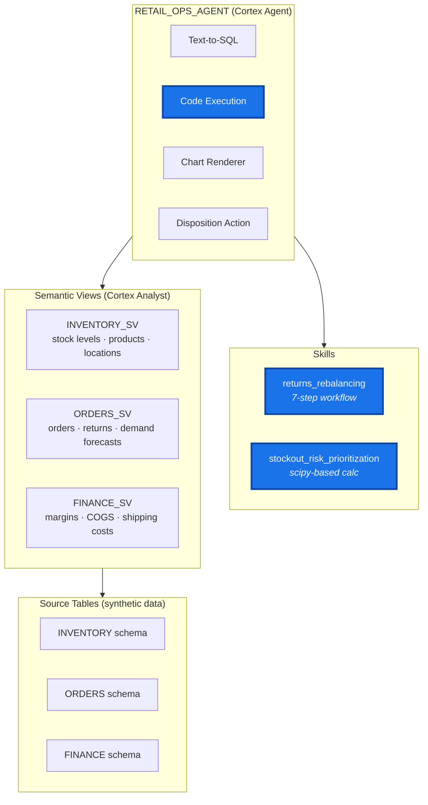

# Skilled Agents for Retail Supply Chain

This project builds an AI-powered retail supply chain co-worker built on [Snowflake Cortex Agents](https://docs.snowflake.com/en/user-guide/snowflake-cortex/cortex-agent) and Snowflake Co-Work. It demonstrates how to extend a Cortex Agent beyond basic Q&A into a system that automates real-world inventory management workflows. The agent answers natural language questions about inventory, orders, returns, and finance across a multi-location retail network — and uses two specialized skills to orchestrate multi-step analytical workflows that go beyond simple data lookups.

The agent that powers CoWork automates not just the process of getting insights from retail supply chain data, but executes business processes as laid out through skills on a human operational manager's commands.

With such skilled co-workers, area managers and store managers for retailers that make inventory decisions on a daily basis can use a single pane of glass to understand their inventory state and trigger actions across locations.


### What you'll build

**Two production-style agent skills** automating real inventory management workflows:

- **Returns-Driven Inventory Rebalancing** — A 7-step decision workflow that pulls return inflows, cross-references demand signals and item condition, evaluates transfer economics (shipping cost vs. margin recovery), and produces actionable RESTOCK / TRANSFER / LIQUIDATE recommendations with cost justification.

- **Stockout Risk Prioritization** — A probabilistic ranking workflow that calculates P(stockout) during lead time using a custom Python script (`stockout_risk.py`) with scipy's normal distribution CDF, then weights results by gross margin to produce a prioritized reorder list sorted by expected cost of inaction.

**Custom Python with the code execution tool** — The stockout skill shows how to pair a Cortex Agent's code execution tool with a purpose-built Python calculation. The agent fetches inventory and demand data via text-to-SQL, then passes it to `stockout_risk.py` which computes the statistical stockout probability per SKU. This pattern lets you embed domain-specific quantitative logic (forecasting models, optimization solvers, scoring algorithms) that LLMs cannot reliably perform on their own.

**A repeatable pattern** — The skill structure (markdown workflow + supporting code + semantic views) is designed to be forked and adapted. Add your own skills by following the same layout under `cortex_agents/skills/`.

## Architecture



## Repository Structure

```
├── deploy/
│   └── skills/deploy-retail-supply-chain/
│       ├── SKILL.md                      # Deployment orchestration (for Cortex Code)
│       ├── setup_prerequisites.sql       # ACCOUNTADMIN one-time setup
│       ├── project_scaffolding_deploy.sql # DB, schemas, tables, stages, UDFs
│       ├── seed_source_data.sql          # Synthetic data seeding
│       └── teardown.sql                  # Remove all project resources
├── eval/
│   ├── agent_eval_config.yaml            # Evaluation config (metrics + custom rubrics)
│   └── deploy_eval_dataset.sql           # Creates + populates the eval dataset table
└── retail_supply_chain_dbt/
    ├── dbt_project.yml
    ├── packages.yml
    ├── profiles.yml
    ├── cortex_agents/
    │   ├── rebalancing_agent_with_skills.yml   # Agent spec (with skills)
    │   ├── rebalancing_agent_no_skills.yml     # Agent spec (baseline, no skills)
    │   └── skills/
    │       ├── returns_rebalancing/
    │       │   └── SKILL.md                    # 7-step returns disposition workflow
    │       └── stockout_risk_prioritization/
    │           ├── SKILL.md                    # Margin-aware stockout risk workflow
    │           └── stockout_risk.py            # Python scipy-based P(stockout) calc
    ├── macros/
    │   ├── create_cortex_agent.sql            # dbt macro to CREATE/ALTER AGENT
    │   └── generate_schema_name.sql
    └── models/
        ├── sources.yml                        # Source definitions (3 schemas, 9 tables)
        ├── orders/
        │   ├── schema.yml
        │   └── daily_return_rates_by_sku_channel.sql
        └── semantic_views/
            ├── inventory_sv.sql               # Stock levels, products, locations
            ├── orders_sv.sql                  # Orders, returns, demand forecasts
            └── finance_sv.sql                 # Costs, margins, shipping
```

## Getting Started

This project is designed to be deployed using [Cortex Code](https://docs.snowflake.com/en/user-guide/cortex-code/cortex-code) — Snowflake's AI-powered IDE. A deployment skill automates the entire setup end-to-end, handling infrastructure creation, data seeding, dbt deployment, and agent creation interactively.

> **Note:** The data model, reasoning steps in the skill, and calculations used throughout this project are illustrative of their real-life counterparts but may not exactly match any particular process. All of these pieces — the data schema, agent logic, and analytical formulas — can be adjusted when adopting this for your own workflows.

### Prerequisites

- A Snowflake account with [Cortex Agents](https://docs.snowflake.com/en/user-guide/snowflake-cortex/cortex-agent) enabled
- [Cortex Code](https://docs.snowflake.com/en/user-guide/cortex-code/cortex-code) installed and connected to your Snowflake account
- [Snowflake CLI](https://docs.snowflake.com/en/developer-guide/snowflake-cli/index) (`snow`) installed and configured
- A role with `CREATE DATABASE` privilege
- ACCOUNTADMIN access for one-time integration setup

### Step 1: Clone and Open in Cortex Code

```bash
git clone https://github.com/Snowflake-Labs/skilled-agents-for-retail-supply-chain.git
```

Open the cloned directory in Cortex Code.

### Step 2: Deploy with Cortex Code

In the Cortex Code chat panel, type:

> **"Deploy the retail supply chain project"**

Cortex Code will activate the deployment skill (`deploy/skills/deploy-retail-supply-chain/SKILL.md`) and walk you through the process interactively:

1. **Confirm configuration** — Cortex Code asks for your deployment role and external access integration name
2. **Account prerequisites** — Presents the ACCOUNTADMIN setup SQL (warehouse, integrations, grants) for you to run
3. **Infrastructure** — Creates the database, schemas, tables, stages, and UDFs
4. **Seed data** — Populates tables with synthetic retail data (50 products, 5 locations, ~250 stock records, 200 orders, ~150 returns)
5. **Upload to stage** — PUTs the agent spec and skill files to internal stages
6. **dbt deploy + execute** — Deploys and runs the dbt project server-side (builds transformation model + 3 semantic views)
7. **Create agent** — Creates `RETAIL_OPS_AGENT` via dbt macro
8. **Verify** — Confirms the agent and semantic views are live

The skill handles role substitution, execution ordering, and error recovery automatically. You only need to confirm the ACCOUNTADMIN step and answer the initial configuration prompts.

### Deployment Scope Options

The skill supports three deployment scopes:

| Scope | What it does | When to use |
|-------|-------------|-------------|
| **Full** | Infrastructure + data + agent (all steps) | First-time setup or full rebuild |
| **Update** | Agent spec + skills + models only | After editing agent YAML or skill files |
| **Data** | Reseed source tables + rebuild models | After modifying seed data |
| **Teardown** | Remove all project resources | Done with the demo, want a clean slate |

### Incremental Updates

After the initial deployment, use Cortex Code for targeted updates:

- **Changed agent behavior?** — "Redeploy the retail supply chain agent" (Update scope)
- **Modified skills?** — "Update the retail supply chain skills" (Update scope)
- **Changed source data?** — "Reseed the retail supply chain data" (Data scope)

### Teardown (Remove All Resources)

To completely remove all Snowflake objects created by this project, use Cortex Code:

> **"Tear down the retail supply chain project"**

Or select **Teardown** when prompted for deployment scope. This removes:

- Cortex Agent, dbt project object, and semantic views
- All tables, stages, UDFs, and stored procedures
- The database (`RETAIL_SUPPLY_CHAIN_DB`) and all schemas
- Account-level objects (warehouse, integrations) — **requires ACCOUNTADMIN**

You can also run the teardown script directly:

```bash
snow sql -f deploy/skills/deploy-retail-supply-chain/teardown.sql
```

> **Note on privileges:** Sections 1–9 of the teardown script run under your deployment role and drop all project-specific objects. Section 10 (warehouse, notification integration, external access integration, network rule, and the `SHARED_OBJECTS` database) **requires ACCOUNTADMIN** and is commented out by default. Uncomment and run those statements separately as ACCOUNTADMIN if you want a full cleanup. Skip them if other projects share those objects.

> **Warning:** Teardown is destructive and irreversible. All data will be lost. The script prints a summary report of removed objects at the end.

### Verification

After deployment completes, Cortex Code runs verification automatically. You can also check manually:

```sql
SHOW AGENTS IN DATABASE RETAIL_SUPPLY_CHAIN_DB;
SHOW SEMANTIC VIEWS IN SCHEMA RETAIL_SUPPLY_CHAIN_DB.AGENT;
```

Expected output: `RETAIL_OPS_AGENT` and three semantic views (`INVENTORY_SV`, `ORDERS_SV`, `FINANCE_SV`).

### Step 3 (Optional): Evaluate the Agent

Once deployed, you can run the built-in evaluation to measure agent quality. The evaluation dataset is deployed as part of the full deploy (via `eval/deploy_eval_dataset.sql`). To trigger an evaluation run:

```sql
CALL EXECUTE_AI_EVALUATION(
  'START',
  OBJECT_CONSTRUCT('run_name', 'baseline-v1'),
  '@RETAIL_SUPPLY_CHAIN_DB.AGENT.EVAL_STAGE/agent_eval_config.yaml'
);
```

This executes all test cases against the deployed agent and scores them on tool execution accuracy, logical consistency, and skill indicator coverage. See the [Evaluation](#evaluation) section below for more details.

## Using the Agent

Once deployed, interact with the agent via Snowflake Intelligence or the API:

```sql
SELECT SNOWFLAKE.CORTEX.INVOKE_AGENT(
    'RETAIL_SUPPLY_CHAIN_DB.AGENT.RETAIL_OPS_AGENT',
    'Which returned SKUs should be rebalanced this week?'
) AS RESPONSE;
```

**Example questions:**
- "Which returned SKUs should be rebalanced this week?"
- "Show me the return rate trends for electronics"
- "What is the current stock status across my locations?"
- "Analyze pending returns and recommend dispositions"
- "Which SKUs should I prioritize for reorder this week?"

## Evaluation

The `eval/` directory contains the evaluation dataset with a small representative subset of test scenarios for evaluating the agent's tool invocation accuracy using the TEA track of metrics, and its skill activation accuracy using a custom metric configured through the `eval/agent_eval_config.yaml` file.

This dataset is created for use with Snowflake's out-of-the-box implementation of a [GPA-framework for Cortex Agent evaluation](https://docs.snowflake.com/en/user-guide/snowflake-cortex/cortex-agents-evaluations).

Snowflake-native evaluation framework that uses [`EXECUTE_AI_EVALUATION`](https://docs.snowflake.com/en/user-guide/snowflake-cortex/cortex-agent#evaluating-agents) to trigger an evaluation run with the provided config.

### What's included

| File | Purpose |
|------|---------|
| `eval/deploy_eval_dataset.sql` | Creates and populates the `RETAIL_OPS_AGENT_EVAL_DATASET` table with golden test cases |
| `eval/agent_eval_config.yaml` | Evaluation configuration — defines metrics, agent target, and custom scoring rubrics |

The dataset is deployed automatically as part of the full deployment. The config YAML is uploaded to `@RETAIL_SUPPLY_CHAIN_DB.AGENT.EVAL_STAGE`.

### Running an evaluation

```sql
CALL EXECUTE_AI_EVALUATION(
  'START',
  OBJECT_CONSTRUCT('run_name', 'baseline-v1'),
  '@RETAIL_SUPPLY_CHAIN_DB.AGENT.EVAL_STAGE/agent_eval_config.yaml'
);
```

Change the `run_name` value to label different runs (e.g., after modifying skills or the agent spec).

You can also trigger the evaluation from Cortex Code. In the chat panel:

> **"Run the agent evaluation with run name baseline-v1"**

### Metrics

The evaluation scores each test case on:

- **tool_execution_accuracy** — Did the agent invoke the correct tools with appropriate inputs?
- **logical_consistency** — Is the agent's reasoning coherent and grounded in the data?
- **skill_indicator_coverage** (custom) — Did the agent follow the required reasoning steps defined in each test case's `skill_indicators` array?

### Test case categories

| Category | Description |
|----------|-------------|
| `general_query` | Basic lookups that require no skill activation |
| `stockout_risk` | Queries that should trigger the stockout risk prioritization workflow |
| `returns_rebalancing` | Queries that should trigger the returns disposition workflow |
| `cross_domain` | Queries requiring both skills (reserved for future use) |

## Troubleshooting

| Symptom | Cause | Fix |
|---------|-------|-----|
| `Schema does not exist` in dbt | Infrastructure not created | Redeploy with Full scope |
| `Invalid identifier LEAD_TIME_DAYS` | Source tables empty | Redeploy with Data scope |
| `PUT: file not found` | Wrong working directory | Ensure Cortex Code is opened at the project root |
| `Network access denied` during dbt deploy | EAI not configured | Run prerequisites as ACCOUNTADMIN |
| Agent spec invalid | YAML field unsupported | Check spec against [Cortex Agent docs](https://docs.snowflake.com/en/user-guide/snowflake-cortex/cortex-agent) |
| `READ_STAGE_FILE error` on agent creation | Spec not uploaded to stage | Redeploy with Update scope |

## License

Apache 2.0 — see [LICENSE](LICENSE).
